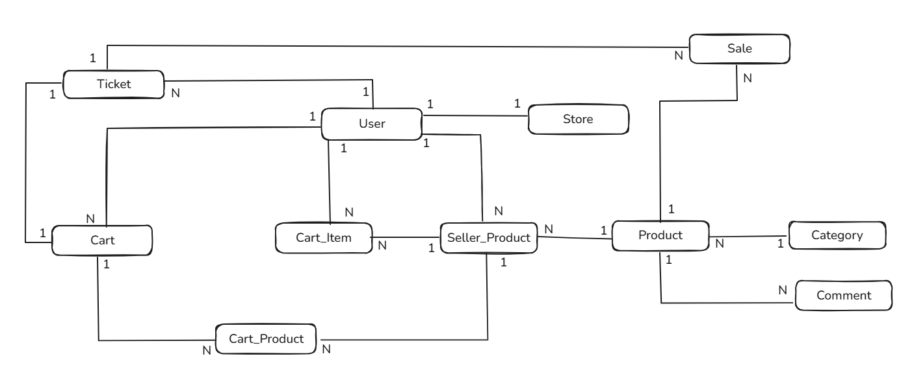
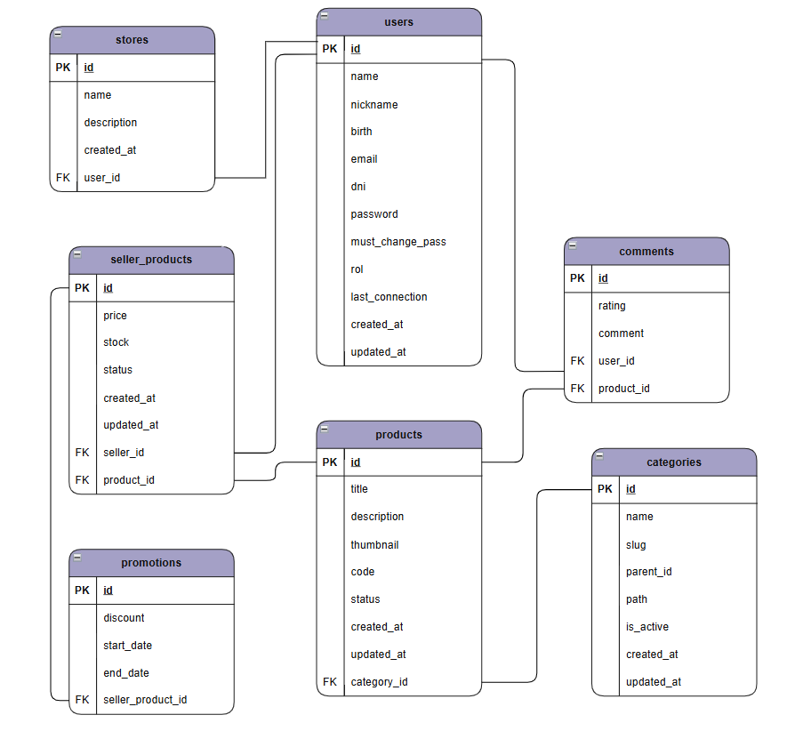
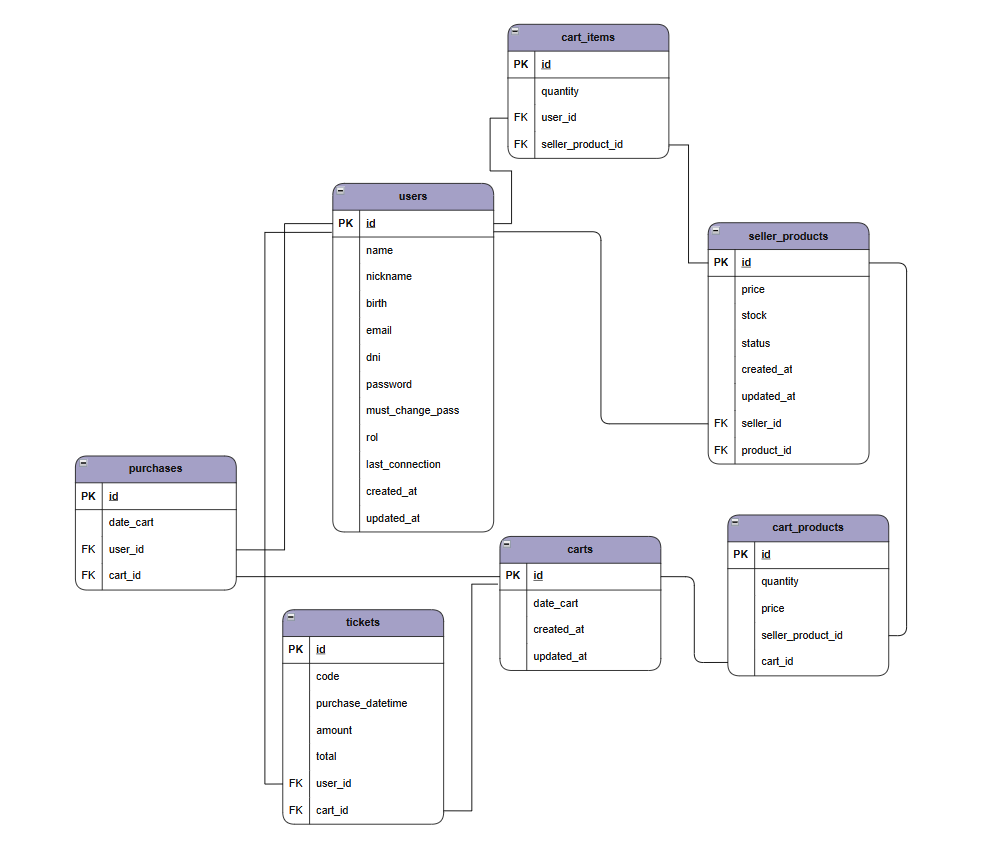
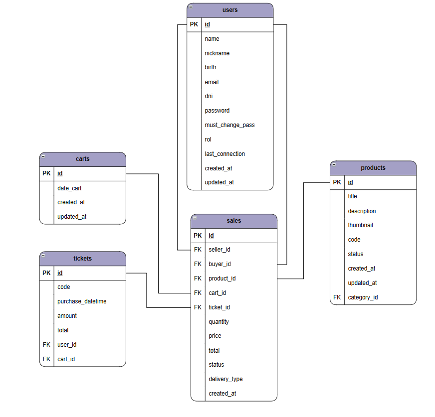

# Modelo de Base de Datos

## Visión general

La aplicación utiliza PostgreSQL como sistema de persistencia principal.

El modelo fue diseñado considerando:

* integridad relacional,
* separación de responsabilidades,
* escalabilidad,
* consistencia transaccional,
* y preservación histórica de información.

La base de datos implementa:

* Foreign Keys,
* CHECK constraints,
* UNIQUE constraints,
* índices,
* y triggers automáticos.

---

# Tecnologías utilizadas

* PostgreSQL
* SQL
* pg
* Triggers PL/pgSQL

---

# Entidades principales

## Usuarios (`users`)

Representa los usuarios registrados del sistema. Lo que define si un usuario es vendedor o usuario es el rol.  

**NOTA:** Solo los usuarios "premium" son los que pueden publicar y vender productos.

Responsabilidades:

* autenticación,
* autorización,
* administración de roles,
* compras,
* ventas,
* y gestión de tiendas.

Características relevantes:

* roles mediante CHECK constraint,
* emails únicos,
* DNI único,
* timestamps automáticos.

---

## Productos (`products`)

Representa el catálogo global de productos.

Responsabilidades:

* información general del producto,
* categorización,
* descripción base,
* thumbnail.

Los productos no almacenan:

* stock,
* precio,
* ni vendedor.

Esa responsabilidad pertenece a `seller_products`.

---

## Inventario por vendedor (`seller_products`)

Representa publicaciones individuales de productos por vendedor.

Responsabilidades:

* stock,
* precio,
* disponibilidad,
* promociones.

Relaciones:

* un usuario puede publicar múltiples productos,
* múltiples vendedores pueden publicar el mismo producto.

---

## Categorías (`categories`)

Implementan una estructura jerárquica de categorías.

Características:

* relaciones padre-hijo,
* slugs únicos por nivel,
* path jerárquico,
* navegación estructurada.

---

## Carrito (`cart_items`)

Representa productos agregados temporalmente por un usuario antes de realizar la compra.

Características:

* relación usuario-producto,
* control de cantidad,
* unicidad por producto agregado.

---

## Compras (`purchases`)

Representa compras realizadas por usuarios. Pensada para crecimiento Futuro

Cada compra se relaciona con:

* carrito histórico

---

## Snapshot de compra (`cart_products`)

Almacena los productos comprados en una transacción específica.

Se preserva:

* precio histórico,
* cantidad,
* producto vendido,
* referencia al carrito histórico.

---

## Snapshot histórico de una venta (`sales`)

Representa una fila individual por producto vendido.

Responsabilidades:

* seguimiento de estados,
* información de vendedor y comprador,
* control de entrega,
* trazabilidad de ventas.

---

## Tickets (`tickets`)

Representan comprobantes generados durante una compra.

Incluyen:

* código,
* fecha,
* montos,
* total,
* referencias de compra.

# Diagramas entidad-relación

## DER lógico

Representación conceptual de las principales entidades y relaciones del sistema.



---

## DER físico

El modelo físico fue dividido por dominios funcionales para mejorar legibilidad y reflejar la separación lógica del sistema.

### Dominio Sellers

Incluye:

* usuarios,
* tiendas,
* producto de vendedores,
* productos,
* categorías,
* promociones.



---

### Dominio Buyers

Incluye:

* usuarios,
* carrito actual,
* carritos comprados,
* compras,
* productos de vendedores,
* tickets.



---

### Dominio Orders

Incluye:

* usuarios,
* tickets,
* ventas,
* productos,
* carritos,



---

# Relaciones principales

## Relación uno a muchos(1:N)

### Usuarios → Direcciones

```
users → addresses
```

Un usuario puede tener múltiples direcciones.

---

### Usuarios → Productos publicados

```
users → seller_products
```

Un vendedor puede publicar múltiples productos.

---

### Categorías → Productos

```
categories → products
```

Una categoría puede contener múltiples productos.

---

## Relación muchos a muchos(N:M)

### Productos ↔ Vendedores(users Premium)

Implementada mediante:

```
seller_products
```

Esto permite:

* múltiples vendedores por producto,
* stock independiente,
* precio independiente.

---

### Carritos ↔ Productos comprados

Implementada mediante:

```         
cart_products
```

Permite almacenar:

* cantidad,
* precio histórico,
* referencias de compra.

---


# Restricciones implementadas

## Foreign Keys

Utilizadas para mantener integridad relacional entre entidades.

---

## UNIQUE constraints

Ejemplos:

* email único,
* DNI único,
* slug único por jerarquía,
* combinación seller-product única.

---

## CHECK constraints

Utilizados para validar estados válidos.

Ejemplos:

* roles permitidos,
* estados de venta,
* tipo de entrega,
* rating entre 1 y 5.

---

# Índices

La base de datos implementa índices sobre campos utilizados frecuentemente para:

* búsquedas jerárquicas

## Ejemplos

### Índice por path de categorías

Optimiza búsquedas jerárquicas:

```
WHERE path LIKE 'tecnologia/%'
```

---

### Índice por parent_id

Optimiza obtención de categorías hijas.

```
SELECT * FROM categories
WHERE parent_id = 1;
```

---

### Índice por slug

Optimiza búsquedas directas de categorías.

---

# Triggers automáticos

Se utilizan triggers para actualizar automáticamente el campo:

```
updated_at
```

Tablas implementadas:

* users
* products
* seller_products
* categories

---

# Decisiones técnicas relevantes

## Separación entre catálogo e inventario

El sistema separa:

* catálogo global (`products`)
* publicaciones individuales (`seller_products`)

Esto permite:

* múltiples vendedores por producto,
* stock independiente,
* precios independientes,
* promociones individuales.

---

## Categorías jerárquicas mediante path

Las categorías implementan:

* `parent_id`
* `slug`
* `path`

Esto simplifica:

* navegación,
* búsquedas jerárquicas,
* generación de URLs amigables,
* y filtrado de subcategorías.

---

## Snapshot histórico de compras

La compra almacena:

* precio histórico,
* cantidad,
* total,
* referencias al carrito.

Esto evita inconsistencias futuras si un producto cambia luego de la compra.

---

## Uso de restricciones relacionales

La base de datos implementa distintas estrategias de eliminación referencial según las necesidades de integridad de cada entidad:

* `ON DELETE CASCADE` para entidades dependientes que no tienen sentido sin su relación principal.
* `ON DELETE SET NULL` para relaciones opcionales donde la entidad puede continuar existiendo.
* `ON DELETE RESTRICT` para preservar integridad histórica y evitar eliminación de información crítica.

---

# Objetivos del diseño

El modelo busca:

* preservar consistencia,
* mantener integridad histórica,
* soportar múltiples vendedores,
* optimizar consultas frecuentes,
* y facilitar evolución futura del sistema.
